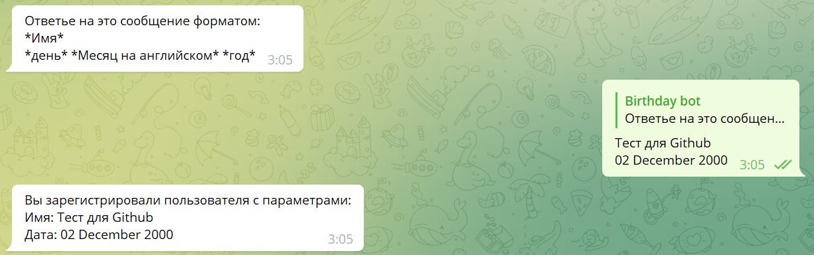
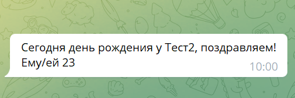

# 📅Telegram Birthsday Bot

`🎉 Бот для телеграм-чатов, хранящий дни рождения и уведомляющий о них. Этот бот очень удобен, потому что находится в Телеграме, которым каждый из нас пользуется. 📅 Если вы часто забываете поздравить кого-то, теперь ваша проблема будет решена! 🎈`

🤖Telegram bot - [link](https://t.me/Birthday_alerting_bot)

## 👁️Библиотеки, которые использовал при создания:
- Python
- pyTelegramBotAPI
- Poetry build
- PostgreSQL (Heroku)
- Deploy Heroku

## ⚙️Доступные команды в боте:
- ##### /all -  **все дни рождения** 👁️
- ##### /check_birth - **Дни рождения текущего месяца** 📅 
- ##### /create_new_member - **регистрация будущего именинник** ️😊
- ##### /help - **помощь** 🙏
- ##### /start - **начало работы бота** 🤖
- ##### /delete_member - **удаление пользователя** ❌

## Добавление новых именинника в базу 🎉
Для каждого **telegram чата**, включая личные сообщения создается свой **scope** к которому привязываются созданные в нем записи.

Создание записей валидируется на формат ввода, что исключает загрузку в базу плохих данных.
## Алертинг о днях рождения ⏰
**Каждый день** в 10 утра по московскому времени (-3 часа по серверу) определяется разница текущей даты с актуальной выгрузкой данных из БД. При совпадении **отправляется сообщение** с подравлением.

 

